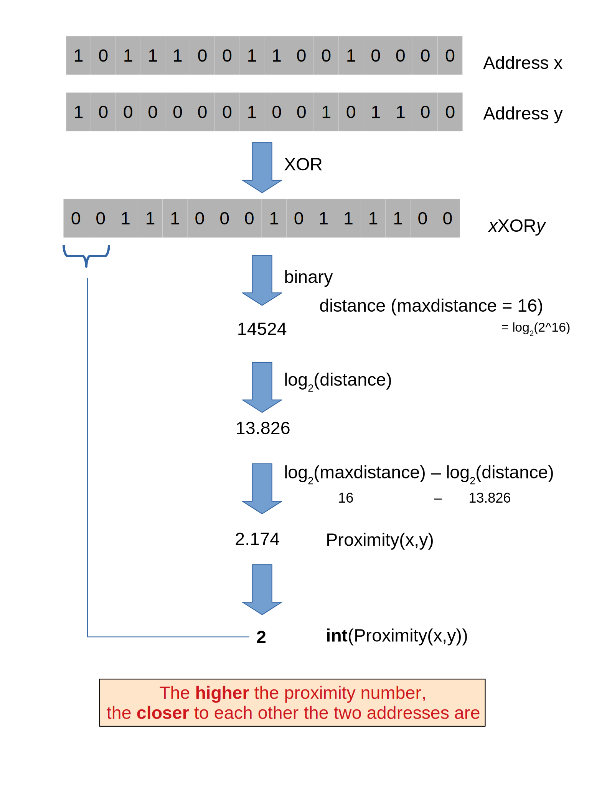
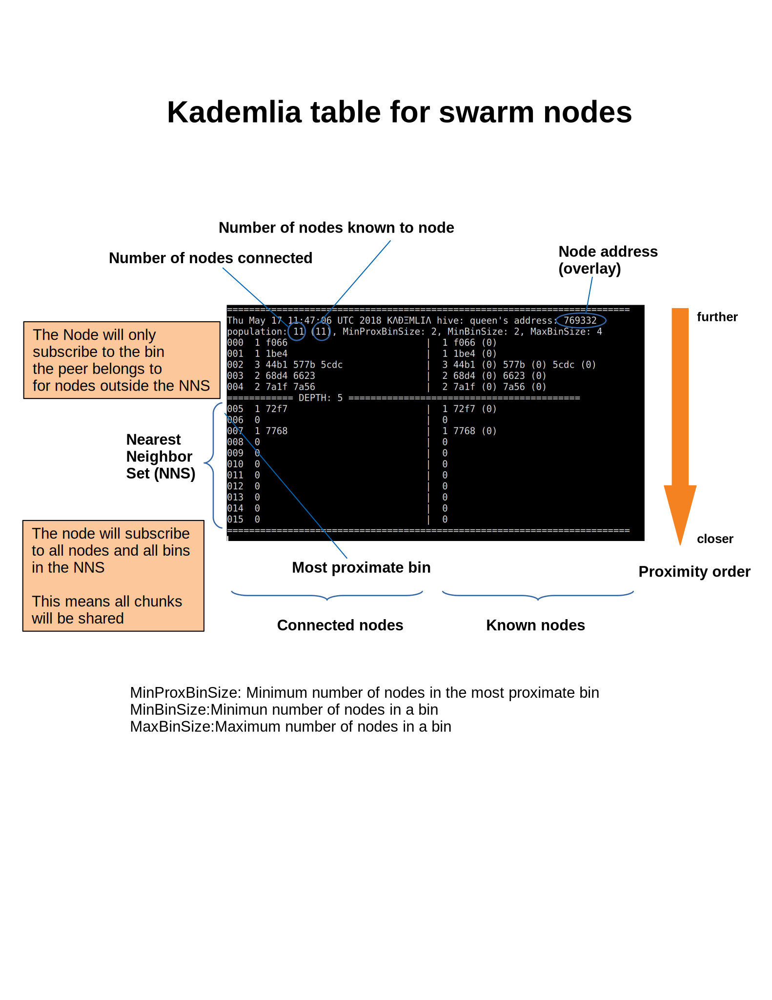
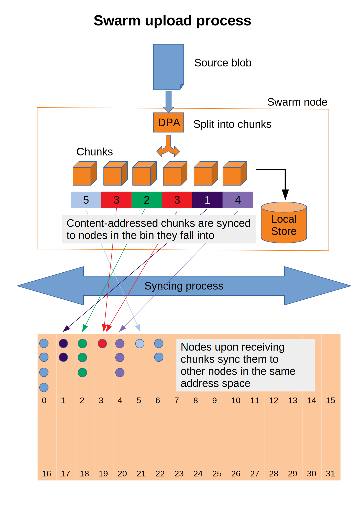
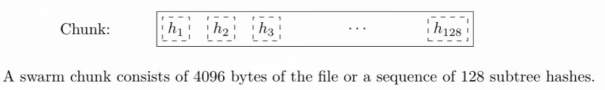
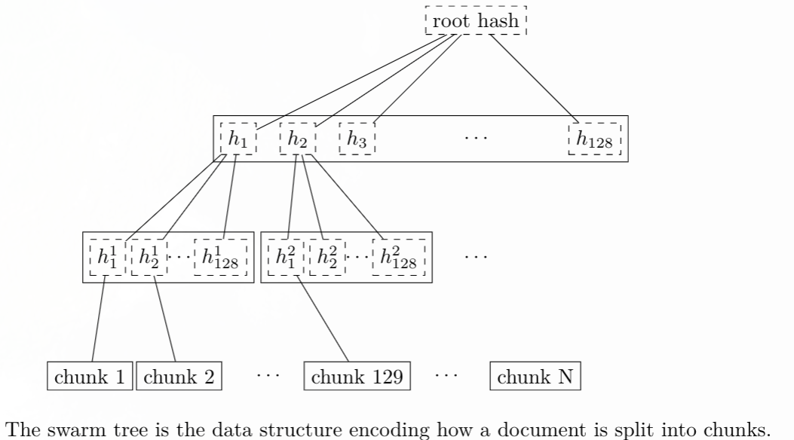

.. _architecture:

*******************
Architecture
*******************

This chapter is aimed at developers who want to understand the underlying concepts and design of swarm.
In the first part we describe the swarm network of nodes. In the second part we explain how messaging and
data storage can use the swarm network as a distributed preimage archive.

..  contents::

Preface
=============

Swarm defines 3 crucial notions

:dfn:`chunk`
  Chunks are pieces of data of limited size (max 4K), the basic unit of storage and retrieval in the swarm. The network layer only knows about chunks and has no notion of document or collection.

:dfn:`reference`
  A reference is a unique identifier of a digital asset that allows clients to retrieve and access the content. For unencrypted content the document reference is cryptographic hash of the data and serves as its content address. This hash reference is a 32 byte hash, which is serialised with 64 hex bytes. In case of an encrypted document the reference has two equal-length components: the first 32 bytes are the content address of the encrypted asset, while the second 32 bytes are the decryption key, altogether 64 bytes, serialised as 128 hex bytes.

:dfn:`manifest`
  A manifests is a data structure describing document collections. A manifest is basically a mapping from strings to documemts. The bzz URL scheme assumes that the content referenced in the domain is a manifest and renders the content entry whose path matches the one in the request path. Given this URL based access to content, manifests can be regarded as routing tables for a website, which makes swarm able to offer virtual hosting, ie serve websites without servers.
  Manifests can also be mapped to a filesystem directory tree, which allows for uploading and downloading directories.
  Finally, manifests can also be considered indexes, so it can be used to implement a simple key value store.

  Manifests specify paths and corresponding content hashes allowing for url based content retrieval.
  Manifests can therefore define a routing table for (static) assets (including dynamic content using for instance static javascript).
  This offers the functionality of :dfn:`virtual hosting`, storing entire directories or web(3)sites, similar to www but
  without servers.

.. image:: img/dapp-page.svg
   :alt: Example of how swarm could serve a web page
   :width: 400 

In this guide, content is understood very broadly in a technical sense denoting any blob of data.
Swarm defines a specific identifier for a piece of content. This identifier part of the reference serves as the retrieval address for the content.
This address needs to be

* collision free (two different blobs of data will never map to the same identifier)
* deterministic (same content will always receive the same identifier)
* uniformly distributed

The choice of identifier in swarm is the hierarchical swarm hash described in :ref:`swarm_hash`.
The properties above let us view the hash as addresses at which content is expected to be found.
Since hashes can be assumed to be collision free, they are bound to one specific version of a content, i.e. Hash addressing therefore is immutable in the strong sense that you cannot even express mutable content: "changing the content changes the hash".

Users of the web, however, are accustomed to mutable resources, looking up domains and expect to see the most up to date version of the 'site'. Mutable resources are made possible by the ethereum name service (ENS) and Mutable Resource Updates (MRU).
The ENS is a smart contract on the ethereum blockchain which enables domain owners to register a content reference to their domain.
Using ENS for domain name resolution, the url scheme provides
content retrieval based on mnemonic (or branded) names, much like the DNS of the world wide web, but without servers.
MRU is an off-chain solution for communicating updates to a resource, it offers cheaper and faster updates than ENS, yet the updates can be consolidated on ENS by any third party willing to pay for the transaction.

Just as content in swarm is identified via a swarm hash, so too is every Swarm node in the network. All Swarm nodes have their own :dfn:`base address` which is derived as the (keccak 256bit sha3) hash of the public key of an ethereum account, the so called :dfn:`swarm base account` of the node. These node addresses define a location in the same address space as the data.

When content is uploaded to swarm it is chopped up into pieces called chunks. Each chunk is accessed at the address defined by its swarm hash. The hashes of data chunks themselves are packaged into a chunk which in turn has its own hash. In this way the content gets mapped to a chunk tree. This hierarchical swarm hash construct allows for merkle proofs for chunks within a piece of content, thus providing swarm with integrity protected random access into (large) files (allowing for instance skipping safely in a streaming video or looking up a key in a database file).

Swarm implements a :dfn:`strictly content addressed distributed hash table` (DHT). Here 'strictly content addressed' means that the node(s) closest to the address of a chunk do not only serve information about the content but actually host the data. (Note that although it is part of the protocol, we cannot have any sort of guarantee that it will be preserved. this is a caveat worth stating again: no guarantee of permanence and persistence). In other words, in order to retrieve a piece of content (as a part of a larger collection/document until storage insurance is implemented) a chunk must reach its destination from the uploader to the storer when storing/uploading and must also be served back to a requester when retrieving/downloading.
The viability of both hinges on the assumption that any node (uploader/requester) can 'reach' any other node (storer). This assumption is guaranteed with a special :dfn:`network topology` (called :dfn:`kademlia`), which guarantees a maximum time for lookups logarithmic in the network size.

.. note:: There is no such thing as delete/remove in swarm. Once data is uploaded there is no way you can initiate her to revoke it.

Nodes cache content that they pass on at retrieval, resulting in an auto scaling elastic cloud: popular (oft-accessed) content is replicated throughout the network decreasing its retrieval latency. Caching also results in a :dfn:`maximum resource utilisation` in as much as nodes will fill their dedicated storage space with data passing through them. If capacity is reached, least accessed chunks are purged by a garbage collection process. As a consequence, unpopular content will end up
getting deleted. Storage insurance (to be implemented in POC4 by Q1 of 2019) will offer users a secure guarantee to protect important content from being purged.

Overlay network
=====================

Logarithmic distance
---------------------------------------------------

The distance metric :math:`MSB(x, y)` of two equal length byte sequences :math:`x` an :math:`y` is the value of the binary integer cast of :math:`x XOR y` (bitwise xor). The binary cast is big endian: most significant bit first (=MSB).

:math:`Proximity(x, y)` is a discrete logarithmic scaling of the MSB distance.
It is defined as the reverse rank of the integer part of the base 2
logarithm of the distance.
It is calculated by counting the number of common leading zeros in the (MSB)
binary representation of :math:`x XOR y` (0 farthest, 255 closest, 256 self).

Taking the :dfn:`proximity order` relative to a fix point :math:`x` classifies the points in
the space (byte sequences of length :math:`n`) into bins. Items in each are at
most half as distant from :math:`x` as items in the previous bin. Given a sample of
uniformly distributed items (a hash function over arbitrary sequence) the
proximity scale maps onto series of subsets with cardinalities on a negative
exponential scale.

It also has the property that any two addresses belonging to the same bin are at
most half as distant from each other as they are from :math:`x`.

If we think of random sample of items in the bins as connections in a network of interconnected nodes than relative proximity can serve as the basis for local
decisions for graph traversal where the task is to find a route between two
points. Since in every hop, the finite distance halves, as long as each relevant bin is non-empty, there is
a guaranteed constant maximum limit on the number of hops needed to reach one
node from the other.

.. image:: img/topology.svg
   :alt: Kademlia topology in swarm
   :width: 500

Kademlia topology
----------------------

Swarm uses the ethereum devp2p rlpx  as the underlay transport. This uncommon variant allows semi-stable peer connections (over TCP), with authenticated, encrypted, synchronous data stream.

We say that a node has dfn:`kademlia connectivity` if (1) it is connected to at least one node for each proximity order up to (but excluding) some maximum value d (called the dfn:`saturation depth`) and (2) it is connected to all nodes whose proximity order relative to the node is greater or equal to d.

If each point of a connected subgraph has kademlia connectivity, then we say the subgraph has a dfn:`kademlia topology`. In a graph with kademlia topology, (1) a path between any two points exists, (2) it can be found using only local decisions on each hop and (3) is guaranteed to terminate in no more steps than the depth of the destination plus one.

Given a set of points uniformly distributed in the space (e.g., the results of a hash function applied to swarm data) the proximity bins map onto a series of subsets with cardinalities on a negative exponential scale, i.e., PO bin 0 has half of the points of any random sample, PO bin 1 has one fourth, PO bin 2 on eighth, etc.
The expected value of saturation depth in the network is log2(N). The last bin can just merge all bins deeper than the depth and is called the dfn:`most proximate bin`.

The properties of a kademlia graph can be used for routing messages between nodes in a network using overlay addressing. Nodes in the swarm network are identified by the hash of the ethereum address of the swarm base account. This serves as their overlay address, the proximity order bins are calculated based on these addresses.
Peers connected to a node define another, live kademlia table,
where the graph edges represent devp2p rlpx connections.

If each node in a set has a saturated kademlia table of connected peers, then the nodes `live connection' graph has kademlia topology.
In a dfn:`forwarding kademlia` network, a message is said to be dfn:`routable` if there exists a path from sender node to destination node through which the message could be relayed.
In a mature subnetwork with kademlia topology every message is routable.
A large proportion of nodes are not stably online; keeping several connected peers in its PO bins, each node can increase the chances that it can forward messages at any point in time, even if a relevant peer drops.

Bootstrapping and discovery
----------------------------

Nodes joining a decentralised network  are supposed to be  naive, i.e., potentially connect via a single known peer. For this reason, the bootstrapping process  will need to include a discovery component with the help of which nodes exchange information about each other.

The protocol is as follows:
Initially, each node has zero as their saturation depth. Nodes keep advertising their saturation depth as it changes to their connected peers. If a node establishes a new connection, it notifies each of its peers about it if the new connection's proximity order relative to the respective peer is not lower than the peer's advertised saturation depth. The notification is always sent to each peer that shares a PO bin with the new connection. In particular, notification contains  full overlay and underlay address information.
Light nodes that do not wish to relay messages and do not aspire to build up a healthy  kademlia are discounted.

As a node is being notified of new peer addresses, it stores them in  a kademlia table of known peers.
While it listens to incoming connections, it also proactively attempts to connect to nodes in order to achieve saturation: it tries to connect to each known node that is within the PO boundary of N dfn:`nearest neighbours` called dfn:`nearest neighbour depth` and (2) it tries to fill each bin up to the nearest neighbour depth with healthy peers. To satisfy (1) most efficiently, it attempts to connect to the peer that is most needed at any point in time. Low (far) bins are more important to fill than high (near) ones since they handle more volume. Filling an empty bin with one peer is more important than adding new peer to a non-empty bin, since it leads to a saturated kademlia earlier. Therefore the protocol uses a bottom-up, depth-first strategy to choose a peer to connect to.  Nodes that are tried but failed to get connected are retried after a time interval that doubles after each attempt. After a certain number of attempts such nodes are no longer considered.

After a sufficient number of nodes are connected, a bin becomes saturated, and the bin saturation depth can increase.
Nodes keep advertising their current saturation depth to their peers if it changes.
As their saturation depth increases, nodes will get notified of fewer and fewer peers. Once the node finds all their nearest neighbours and has saturated all the bins, no new peers are expected. For this reason, a node can conclude  a saturated kademlia state if it receives no new peers (for some time). The node does not need to know the number of nodes in the network. In fact, some time after the node stops receiving new peer addresses, the node can effectively estimate the size of the network from the depth.

Such a network can readily be used for a forwarding-style messaging system. Swarm's PSS is based on this.
Swarm also uses this network to implement its storage solution.

Distributed preimage archive
==============================

dfn:`Distributed hash tables` (DHTs) utilise an overlay network to implement a key-value store distributed over the nodes. The basic idea is that the keyspace is mapped onto the overlay address space, and information about an element in the container is to be found with nodes whose address is in the proximity of the key.
DHTs for decentralised content addressed storage typically associate content fingerprints with a list of nodes (seeders) who can serve that content. However, the same structure can be used directly: it is not information about the location of content that is stored at the node closest to the address (fingerprint), but the content itself. We call this structure dfn:`distributed preimage archive` (DPA).

A DPA is opinionated about which nodes store what content and this implies a few more restrictions. (1) load balancing of content is required among nodes and is realised by splitting content into equal sized chunks (dfn:`chunking`). (2) there has to be a process whereby chunks get to where they are supposed to be stored dfn:`syncing`; and (3) since nodes do not have a say in what they store, measures of dfn:`plausible deniability` should be employed.

Chunk retrieval in this design is carried out by relaying retrieve requests from a requestor node to a storer node and passing the
retrieved chunk from the storer back to the requestor.

Since swarm implements a DPA (over chunks of 4096 bytes), relaying a retrieve request to the chunk address as destination is equivalent to passing the request towards the storer node. Forwarding kademlia is able to route retrieve requests to the neighbourhood of the chunk address. For the delivery to happen we just need to assume that each node when it forwards a retrieve request, remembers the requestors.
Once the request reaches the storer node, delivery of the content can be initiated and consists in relaying the chunk data back to the requestor(s).

In this context, a chunk is retrievable for a node if the retrieve request is routable to the storer closest to the chunk address and the delivery is routable from the storer back to the requestor node.
The success of retrievals depends on the availability of strategies for finding such routes. Also, the latency of request--delivery roundtrips hinges on the number of hops and the bandwidth quality of each node along the way.

Redundancy
--------------

If the closest node is the only storer and drops out, there is no way to retrieve the content. This basic scenario is handled by having a set of nearest neighbours holding replicas of each chunk that is closest to any of them.
A chunk is said to be dfn:`redundantly retrievable` of degree math:`n` if it is retrievable and would remain so after any math:`n-1` responsible nodes leave the network.
In the case of request forwarding failures, one can retry, or start concurrent retrieve requests.
Such fallback options are not available if all the storer nodes go down. Therefore redundancy is of major importance.

The area of the fully connected neighbourhood defines an dfn:`area of responsibility`.
A storer node is responsible for (storing) a chunk if the chunk falls within the node's area of responsibility.
Let us assume then (1) the forwarding strategy that relays requests along stable nodes and (2) the storage strategy that each node in the nearest neighbourhood (of mimimum R peers) stores all chunks within the area of responsibility. As long as these assumptions hold, each chunk is retrievable even if math:`R-1` storer nodes drop offline simultaneously. As for (2), we still need to assume that every node in the nearest neighbour set can store each chunk.

Caching and purging Storage
----------------------------

Node syncronisation is the protocol that makes sure content ends up where it is queried. Since the swarm has a address-key based retrieval protocol, content will be twice as likely be requested from a node that is one bit (one proximity bin) closer
to the content's address. What a node stores is determined by the access count of chunks: if we reach capacity the oldest unaccessed chunks are removed.
On the one hand, this is backed by an incentive system rewarding serving chunks.
This directly translates to a motivation, that a content needs to be served with frequency X in order to make your worth while storing. On the one hand frequency of access directly translates to storage count. On the other hand it provides a way to combine proximity and popularity to dictate what is stored.

Based on distance alone (all else being equal, assuming random popularity of chunks), a node could be expected to store chunks up to a certain proximity radius.
However, it is always possible to look for further content that is popular enough to make it worth while storing. Given the power law of popularity rank and the uniform distribution of chunks in address space, one can be sure that any node can expand their storage with content where popularity makes up for their distance.

Given absolute limits on popularity, there might be an actual upper limit on a storage capacity for a single base address. In order to efficiently utilise excess capacity, several nodes should be run in parallel.

This storage protocol is designed to result in an autoscaling elastic cloud where a growth in popularity automatically scales. An order of magnitude increase in popularity will result in an order of magnitude more nodes actually caching the chunk resulting in fewer hops to route the chunk, ie., a lower latency retrieval.

Synchronisation
-------------------

Smart syncronisation is a protocol of distribution which makes sure that these transfers happen. Apart from access count which nodes use to determine which content to delete if capacity is reached, chunks also store their first entry index. This is an arbitrary monotonically increasing index, and nodes publish their current top index, so virtually they serve as timestamps of creation. This index helps keeping track what content to syncronise with a peer.

When two nodes connect and they engage in synchronisation, the upstream node offers all the chunks it stores locally in a datastream per proximity order bin. To receive chunks closer to a downstream than to the upstream, downstream peer subscribes to the data stream of the PO bin it belongs to in the upstream node's kademlia table.
If the peer connection is within nearest neighbour depth the downstream node subscribes to all PO streams that constitute the most proximate bin.

Nodes keep track of when they stored a chunk locally for the first time (for instance by indexing them by an ever incrementing storage count). The downstream peer is said to have completed dfn:`history syncing` if it has (acknowledged) all the chunks of the upstream peer up from the beginning until the time the session started (up to the storage count that was the highest at the time the session
started). Some node is said to have completed dfn:`session syncing` with its upstream peer if it has (acknowledged) all the chunks of the upstream peer up since the session started.

In order to reduce network traffic resulting from receiving chunks from multiple sources, all store requests can go via a confirmation roundtrip.
For each peer connection in both directions, the source peer sends an :dfn:`offeredHashes` message containing a batch of hashes offered to push to the recipient. Recipient responds with a :dfn:`wantedHashes`.

.. image:: img/syncing-high-level.svg
   :alt: Syncing chunks in the swarm network 
   :width: 500

Data layer
===================

There are 4 different layers of data units relevant to swarm:

* :dfn:`message`: p2p RLPx network layer. Messages are relevant for the devp2p wire protocols The :ref:`bzz protocol suite`.
* :dfn:`chunk`: fixed size data unit of storage
*  :dfn:`document`: in want of a better word, we call the smallest unit that is associated with a mime-type and not guaranteed to have integrity unless it is complete. This is the smallest unit semantic to the user, basically a file on a filesystem.
*  :dfn:`collection`: a mapping of paths to documents is represented by the :dfn:`swarm manifest`. This layer has mapping to file system directory tree. Given trivial routing conventions, url can be mapped to documents in a standardised way, allowing manifests to mimic webservers on swarm.

.. index::
   manifest
   chunk
   message
   storage layer

The actual storage layer of swarm consists of two main components, the :dfn:`localstore (LOC)` and the :dfn:`netstore (NET)`. The local store provides consists of an in-memory fast cache (:dfn:`memory store (MEM)`) and a persistent disk storage (:dfn:`dbstore (DBS)`).
The NetStore is extending local store to a distributed storage of swarm and is the interface to .

The :dfn:`distributed preimage archive (DPA)` is the local interface for storage and retrieval of documents. When a document is handed to the DPA for storage, it chunks the document into a merkle hashtree and hands back its root key to the caller (DPA). This key can later be used to retrieve the document in question in part or whole.

The component that chunks the documents into the merkle tree is called the :dfn:`chunker`. Our chunker implements the :dfn:`bzzhash` algorithm which is parallelized tree hash based on an arbitrary chunk hash. When the chunker is handed an I/O reader, it chops the data stream into fixed sized chunks.
The chunks are hashed using an arbitrary chunk hash.
If encryption is used the chunk is encrypted before hashing. The reference of consecutive chunk is concatenated and packaged into a so called dfn:`intermediate chunk`, which in turn is encrypted and hashed and packaged into the next level of intermediate chunks.
For unencrypted content and 32-byte chunkhash, the 4K chunk size enables 128 branches in the resulting swarm hash tree. If we use encryption, the reference is 64-bytes, allowing for 64 branches in the swarm hash tree.
This process of constructing the swarm hash tree will result in a single root chunk, the chunk hash of this root chunk is the swarm hash of the document. The reference to the document is the swarm hash itself if the upload is unencrypted, and the swarm hash concatenated with the decryption key of the rootchunk.

When the DPA is handed a reference for document retrieval, the DPA calls the Chunker which hands back a seekable document reader to the caller. This is a :dfn:`lazy reader` in the sense that it retrieves relevant parts of the underlying document only as they are actually read. Given the document reference, the DPA takes the swarm hash and using the NetStore retrieves the root chunk of the document. After decrypting it if needed, references to chunks on the next level are processed. Since data offsets can easily be mapped to a path of intermediate chunks, random access to a document is efficient and supported on the lowest level. The HTTP API offers range queries on documents and can turn them to offset and span for the lower level API to provide integrity protected random access to documents.

The swarm manifest is a structure that defines a mapping between arbitrary paths and documents to handle document collections. It also includes various metadata associated with the collection and the documents. Most importantly a manifest entry specifies the media mime type of the document so that browsers know how to handle them.

The high level API to the manifests provides functionality to upload and download individual documents as files, collections (manifests) as directories. It also provides an interface to add documents to a collection on a path, delete a document from a collection. Note that deletion here only means that a new manifest is created in which the path in question is missing. There is no other notion of deletion in the swarm.

API is the go implementation (and go API) for these high level functions. There is an http proxy interface as well as a RPC API for these functions. These all differ in their exact functionality due to inherent privilege differences or interface limitations.
These are described in detail in the :ref:`API Reference` section.

.. index::
   API
   HTTP proxy

The :ref:`swap` component keeps track of requests between peers and implements the accounting protocol. It is described in detail in :ref:`Incentivisation`.

In what follows we describe the components in more detail.

.. _swarm_hash:

Swarm hash
===================
.. index::
   hash
   bzzhash

Swarm Hash (a.k.a. `bzzhash`) is a [Merkle tree](http://en.wikipedia.org/wiki/Merkle_tree) hash designed for the purpose of efficient storage and retrieval in content-addressed storage, both local and networked. While it is used in [Swarm], there is nothing Swarm-specific in it and the authors recommend it as a drop-in substitute of sequential-iterative hash functions (like SHA3) whenever one is used for referencing integrity-sensitive content, as it constitutes an improvement in terms of performance and usability without compromising security.

In particular, it can take advantage of parallelisation for faster calculation and verification, can be used to verify the integrity of partial content without having to transmit all of it. Proofs of security to the underlying hash function carry over to Swarm Hash.

Swarm Hash is constructed using any hash function (in our case, Keccak 256 bit SHA3) with a generalization of Merkle's tree hash scheme. The basic unit of hashing is a :dfn:`chunk`, that can be either a :dfn:`data chunk` containing a section of the content to be hashed or an :dfn:`intermediate chunk` containing hashes of its children, which can be of either variety.

Hashes of data chunks are defined as the hashes of the concatenation of the 64-bit length (in LSB-first order) of the content and the content itself. Because of the inclusion of the length, it is resistant to [length extension attacks](http://en.wikipedia.org/wiki/Length_extension_attack), even if the underlying hash function is not.
Hashes of intermediate chunks are defined as the hashes of the concatenation of the 64-bit length (in LSB-first order) of the content hashed by the entire (sub-) tree rooted on this chunk and the references of its children.

To distinguish between the two, one should compare the length of the chunk to the 64-bit number with which every chunk begins. If the chunk is exactly 8 bytes longer than this number, it is a data chunk. If it is shorter than that, it is an inner chunk. Otherwise, it is not a valid Swarm Hash chunk.

For the chunk hash we use a hashing algorithm based on a binary merkle tree over the 32-byte  segments of the real chunk data.
This is ideal for compact solidity-friendly inclusion proofs. For integrity protection the 8 byte span metadata is hashed together with the root of the BMT using Keccak 256 SHA3 to result in the BMT hash.

Chunker
=====================

.. index::
   chunker

:dfn:`Chunker` is the interface to a component that is responsible for disassembling and assembling larger data.
More precisely dfn:`Splitter`  disassembles, while dfn:`Joiner` reassembles documents. Our Splitter implementation is the :dfn:`pyramid` chunker that does not need the size of the file, thus is able to process live capture streams.

When :dfn:`splitting` a document, the DPA pushes the resulting chunks to the localstore and returns the :dfn:`root hash` of the document.

When :dfn:`joining` a document, the chunker needs the root key and returns a :dfn:`lazy reader`. While joining, for chunks not found locally a chunk requests are initiated to retrieve chunks from peers, if the data has been delivered (i.e. retrieved from memory cache, disk-persisted db or cloud based swarm delivery). The chunker then puts these together on demand as and where the reader is read.

.. index::
   chunk size
   merkle tree
   joining
   splitting

.. _incentivisation:

Incentivisation
===========================

swap, swear & swindle
-----------------------------

.. _swap:

SWAP -- Swarm Accounting Protocol
-----------------------------------------------------------------------------------------------

Swarm Accounting Protocol, Secured With Automated Payments

SWEAR -- Storage With Enforced Archiving Rules or Swarm Enforcement And Registration
--------------------------------------------------------------------------------------------------------

SWINDLE -- Secured With INsurance Deposit Litigation and Escrow
--------------------------------------------------------------------------------------------------------
