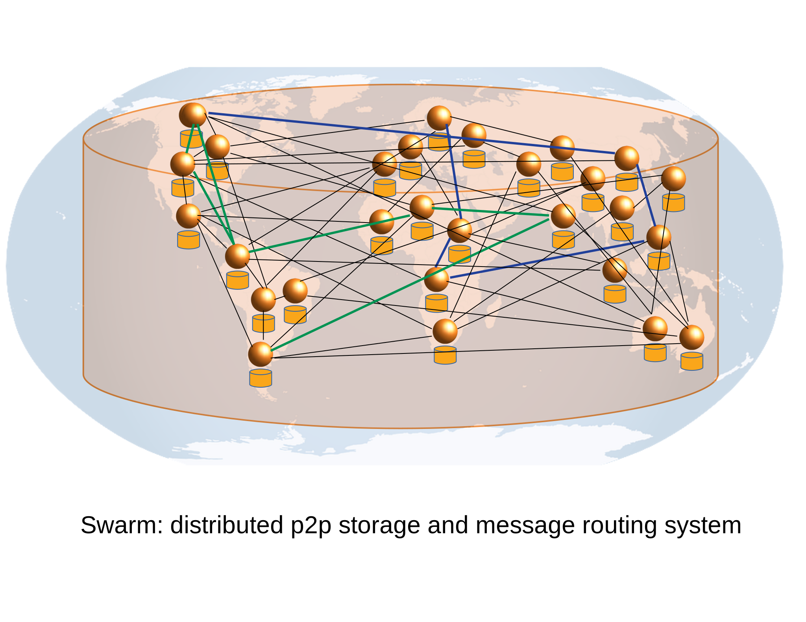

*******************
Introduction
*******************

..  * extension allows for per-format preference for image format

..  image:: img/swarm.png
   :height: 300px
   :width: 238px
   :scale: 50 %
   :alt: swarm-logo
   :align: right

Swarm is a distributed storage platform and content distribution service, a native base layer service of the ethereum :dfn:`Web3.0` stack. The primary objective of Swarm is to provide a sufficiently decentralized and redundant store of Ethereum's public record, in particular to store and distribute Dapp code and data as well as blockchain data. From an economic point of view, it allows participants to efficiently pool their storage and bandwidth resources in order to provide these services to all participants of the network, all while being incentivised by Ethereum.

.. raw:: html

  <iframe width="560" height="315" src="https://www.youtube.com/embed/VgTZV471WFM" style="margin-bottom: 30px;" frameborder="0" allow="autoplay; encrypted-media" allowfullscreen></iframe>

Objective
==========

Swarm's broader objective is to provide infrastructure services for developers of decentralised web applications (Dapps), notably: messaging, data streaming, peer to peer accounting, mutable resource updates, storage insurance, proof of custody scan and repair, payment channels and database services.

From the end user's perspective, Swarm is not that different from the world wide web, with the exception that uploads are not hosted on a specific server. Swarm offers a peer-to-peer storage and serving solution that is DDoS-resistant, has zero-downtime, fault-tolerant and censorship-resistant as well as self-sustaining due to a built-in incentive system which uses peer-to-peer accounting and allows trading resources for payment. Swarm is designed to deeply integrate with the devp2p multiprotocol network layer of Ethereum as well as with the Ethereum blockchain for domain name resolution (using ENS), service payments and content availability insurance.

.. raw:: html

  <iframe width="560" height="315" src="https://www.youtube.com/embed/xrw9rvee7rc" style="margin-bottom: 30px;" frameborder="0" allow="autoplay; encrypted-media" allowfullscreen></iframe>

Please refer to our `development roadmap <https://github.com/ethersphere/swarm/wiki/roadmap>`_ and our `roadmap board <https://github.com/orgs/ethersphere/projects/5>`_ to stay informed with our progress.

Overview
========================

Swarm is set out to provide base layer infrastructure for a new decentralised internet.
Swarm is a peer-to-peer network of nodes providing distributed digital services by contributing resources (storage, message forwarding, payment processing) to each other. These contributions are accurately accounted for on a peer to peer basis, allowing nodes to trade resource for resource, but offering monetary compensation to nodes consuming less than they serve.

The Ethereum Foundation Swarm team is operating a Swarm testnet.
Everyone can join the network by running the Swarm client node on their server, desktop, laptop or mobile device.
The Swarm client is part of the Ethereum stack, with the reference implementation written in golang and found under the `go-ethereum repository <https://github.com/ethereum/go-ethereum>`_.

.. raw:: html

  <iframe width="560" height="315" src="https://www.youtube.com/embed/moEbbjOUUHI" style="margin-bottom: 30px;" frameborder="0" allow="autoplay; encrypted-media" allowfullscreen></iframe>

Swarm defines the :dfn:`bzz suite of devp2p subprotocols` running on the ethereum devp2p network. The bzz subprotocol is in flux, the specification of the wire protocol is considered stable only with POC4 expected 2019.

The Swarm is the collection of nodes of the devp2p network each of which run the :ref:`bzz protocol suite` on the same network id.

Swarm nodes can also connect with one (or several) ethereum blockchains for domain name resolution and one ethereum blockchain for bandwidth and storage compensation.
Nodes running the same network id are supposed to connect to the same blockchain for payments. A Swarm network is identified by its network id which is an arbitrary integer.

Swarm allows for :dfn:`upload and disappear` which means that any node can just upload content to the Swarm and
then is allowed to go offline. As long as nodes do not drop out or become unavailable, the content will still
be accessible due to the 'synchronization' procedure in which nodes continuously pass along available data between each other.

You can read more about these components in the :ref:`architecture` section.

.. note::
  The Swarm public gateways are temporary and users should not rely on their existence for production services.

.. note::
  Uploaded content is not guaranteed to persist on the testnet until storage insurance is implemented (expected in POC4 2019). All participating nodes should consider participation a voluntary service with no formal obligation whatsoever and should be expected to delete content at their will. Therefore, users should under no circumstances regard Swarm as safe storage until the incentive system is functional.

.. note::
  Swarm POC3 allows for encryption. Upload of unencrypted sensitive and private data is highly discouraged as there is no way to undo an upload. Users should refrain from uploading illegal, controversial or unethical content.

Available APIs
================

Swarm offers several APIs:
 * CLI
 * JSON-RPC - using web3.0 bindings over Geth's IPC
 * HTTP interface - every Swarm node exposes a local HTTP proxy that implements the :ref:`bzz protocol suite`
 * Javascript - available through the `swarm-js <https://github.com/MaiaVictor/swarm-js>`_ or `swarmgw <https://www.npmjs.com/package/swarmgw>`_ packages

About
===================

This document
---------------------

This document's source code is found at https://github.com/ethersphere/swarm-guide
The HTML rendered version is available at https://swarm-guide.readthedocs.io/en/latest/

Status
---------------

The status of Swarm is proof of concept 3 release series (POC3).

.. note:: Swarm is experimental code and untested in the wild. Use with extreme care. We encourage developers to connect to the testnet with their permanent nodes and give us feedback.

License
-------------

Swarm is part of the go-ethereum library and (i.e. all code outside of the `cmd` directory) is licensed under the
[GNU Lesser General Public License v3.0 `https://www.gnu.org/licenses/lgpl-3.0.en.html`, also
included in our repository in the COPYING.LESSER `https://github.com/ethereum/go-ethereum/blob/master/COPYING.LESSER` file.

The go-ethereum binaries (i.e. all code inside of the `cmd` directory) is licensed under the
[GNU General Public License v3.0](https://www.gnu.org/licenses/gpl-3.0.en.html), also included
in our repository in the COPYING `https://github.com/ethereum/go-ethereum/blob/master/COPYING.LESSER` file.

Credits
---------------------

Swarm is code by Ethersphere `https://github.com/ethersphere`

The team behind Swarm:

* Viktor Trón @zelig
* Daniel A. Nagy @nagydani
* Aron Fischer @homotopycolimit
* Janos Gulyas @janos
* Louis Holbrook @nolash
* Anton Evangelatov @nonsense
* Fabio Barone @holisticode
* Balint Gabor @gbalint
* Elad Nachmias @justelad
* Lewis Marshal @lmars

Our allies and sponsors are status.im, livepeer.org, jaak.io, mainframe.com, wolk.com, riat.at, datafund.org, 216.com

Swarm is funded by the Ethereum Foundation.

Special thanks to

* Felix Lange, Alex Leverington for inventing and implementing devp2p/rlpx;
* Jeffrey Wilcke and the go team for continued support, testing and direction;
* Gavin Wood and Vitalik Buterin for the vision;
* Nick Johnson @Arachnid for ENS and ENS Swarm integration
* Zsolt Felföldi @zsfelfoldi for his contribution early in the project
* Alex Van der Sande, Fabian Vogelsteller, Bas van Kervel, Victor Maia, Everton Fraga and the Mist team
* Elad Verbin, Nick Savers, Alex Beregszaszi, Daniel Varga, Juan Benet for inspiring discussions and ideas
* Participants of the orange lounge research group and the Swarm orange summits
* Roman Mandeleil and Anton Nashatyrev for the java implementation
* Igor Sharudin, Dean Vaessen for example Dapps
* Community contributors for feedback and testing

Community
-------------------

Daily development and discussions are ongoing in various gitter channels:

* https://gitter.im/ethereum/swarm: general public chatroom about Swarm dev
* https://gitter.im/ethersphere/orange-lounge: our reading/writing/working group and R&D sessions
* https://gitter.im/ethersphere/pss: about postal services on Swarm - messaging with deterministic routing
* https://gitter.im/ethereum/swatch: variable bitrate media streaming and multicast/broadcast solution

Swarm discussions also on the Ethereum subreddit: http://www.reddit.com/r/ethereum

Reporting a bug and contributing
-------------------------------------

Issues are tracked on github and github only. Swarm related issues and PRs are labeled with Swarm:

* https://github.com/ethereum/go-ethereum/labels/swarm
* https://github.com/ethersphere/go-ethereum/issues

Please include the commit and branch when reporting an issue.

Pull requests should by default commit on the `master` branch (edge).

Roadmap and resources
=====================

Swarm roadmap and tentative plan for features and POC series are found on the wiki:

* https://github.com/ethersphere/swarm/wiki/roadmap
* https://github.com/ethersphere/swarm/wiki/swarm-dev-progress
* https://github.com/ethereum/go-ethereum/wiki/swarm---POC-series
* https://github.com/orgs/ethersphere/projects/5

Public gateways
---------------

* http://swarm-gateways.net/

Homepage
--------

the *Swarm homepage* is accessible via Swarm at `theswarm.eth`. The page can be accessed through the public gateway on http://swarm-gateways.net/bzz:/theswarm.eth/

The Swarm page also contains a list of Swarm-related talks (video recording and slides).

You can also find the ethersphere orange papers there.

Example Dapps
-------------

* bzz://swarmapps.eth
  
source code: https://github.com/ethereum/swarm-dapps

Code
----

Source code is at https://github.com/ethereum/go-ethereum/ and our team working copy  https://github.com/ethersphere/go-ethereum/

This document source https://github.com/ethersphere/swarm-guide
