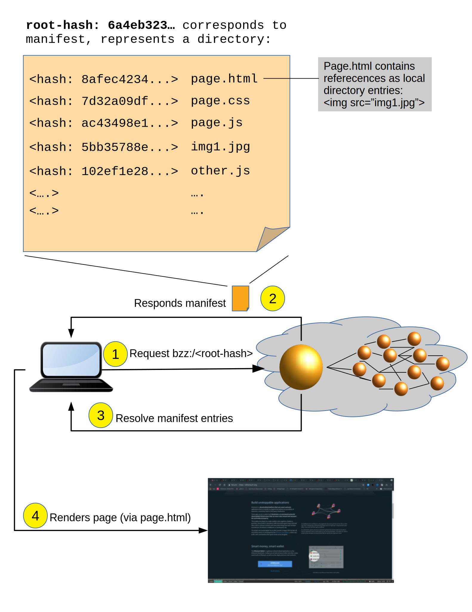

*******************
Introduction
*******************

..  * extension allows for per-format preference for image format

..  image:: img/Swarm-logo.jpg
   :height: 300px
   :width: 300 px
   :scale: 50 %
   :alt: Swarm-logo
   :align: right

Swarm is a distributed storage platform and content distribution service, a native base layer service of the ethereum :dfn:`web 3` stack. The primary objective of Swarm is to provide a sufficiently decentralized and redundant store of Ethereum's public record, in particular to store and distribute dapp code and data as well as block chain data. From an economic point of view, it allows participants to efficiently pool their storage and bandwidth resources in order to provide these services to all participants.

Swarm's broader objective  is to provide infrastructure services for developers of decentralised web applications, notably messaging, data streaming, peer to peer accounting, mutable resource updates (POC3), storage insurance, proof of custody scan and repair, payment channels and database services (POC4).

From the end user's perspective, Swarm is not that different from WWW, except that uploads are not hosted on a specific server. Swarm aims to offer a peer-to-peer storage and serving solution that is DDOS-resistant, zero-downtime, fault-tolerant and censorship-resistant as well as self-sustaining due to a built-in incentive system which uses peer-to-peer accounting and allows trading resources for payment. Swarm is designed to deeply integrate with the devp2p multiprotocol network layer of Ethereum as well as with the Ethereum blockchain for domain name resolution, service payments and content availability insurance (the latter is to be implemented in POC 0.4 by Q1 2019).

Overview
========================

Swarm is set out to provide base layer infrastructure for a new decentralised internet.
Swarm is a peer to peer network of nodes providing distributed digital services by contributing resources (storage, message forwarding, payment processing) to each other. These contributions are accurately accounted for on a peer to peer basis, allowing nodes to trade resource for resource, but offering monetary compensation to nodes consuming less than they serve.

.. image:: img/Swarm-intro.svg
   :alt: Swarm storage and message routing
   :width: 500

The Ethereum Foundation Swarm team is operating a Swarm testnet where Swarm can be tried out.
Everyone can join the network by running the Swarm client node on their server, desktop, laptop or mobile device.
The Swarm client is part of the Ethereum stack, the reference implementation is written in golang and found under the go-ethereum repository. Currently at POC (proof of concept) version 0.3 is running on all nodes.

Swarm offers a local http proxy API that dapps or command line tools can use to interact with Swarm. Some modules like messaging are   only available through RPC-JSON API. The foundation servers on the testnet are offering public gateways, which serve to easily demonstrate functionality and allow free access so that people can try Swarm without even running their own node.

.. note::
  The Swarm public gateways are temporary and users should not rely on their existence for production services.

Swarm defines the :dfn:`bzz suite of devp2p subprotocols` running on the ethereum devp2p network. The bzz subprotocol is in flux, the
specification of the wire protocol is considered stable only with POC4 expected in Q1 2019.

The Swarm of Swarm is the collection of nodes of the devp2p network each of which run the bzz protocol suite on the same network id.

Swarm nodes can also connect with one (or several) ethereum blockchains for domain name resolution and one ethereum blockchain for bandwidth and storage compensation.
Nodes running the same network id are supposed to connect to the same blockchain for payments. A Swarm network is identified by its network id which is an arbitrary integer.

Swarm allows for :dfn:`upload and disappear` which means that any node can just upload content to the Swarm and
then is allowed to go offline. As long as nodes do not drop out or become unavailable, the content will still
be accessible due to the 'synchronization' procedure in which nodes continuously pass along available data between each other.

.. note::
  Uploaded content is not guaranteed to persist on the testnet until storage insurance is implemented (expected in POC4 by Q1 2019). All participating nodes should consider participation a  voluntary service with no formal obligation whatsoever and should be expected to delete content at their will. Therefore, users should under no circumstances regard Swarm as safe storage until the incentive system is functional.

.. note::
  Swarm POC3 allows for encryption. Upload of unencrypted sensitive and private data is highly discouraged as there is no way to undo an upload. Users should refrain from  uploading  illegal, controversial or unethical content.

Swarm defines 3 crucial notions

:dfn:`chunk`
  Chunks are pieces of data of limited size (max 4K), the basic unit of storage and retrieval in the Swarm. The network layer only knows about chunks and has no notion of document or collection.

:dfn:`reference`
  A reference is a unique identifier of a digital asset that allows clients to retrieve and access the content. For unencrypted content the document reference is cryptographic hash of the data and serves as its content address. This hash reference is a 32 byte hash, which is serialised with 64 hex bytes. In case of an encrypted document the reference has two equal-length components: the first 32 bytes are the content address of the encrypted asset, while the second 32 bytes are the decryption key, altogether 64 bytes, serialised as 128 hex bytes.

:dfn:`manifest`
  A manifests is a data structure describing document collections. A manifest is basically a mapping from strings to documemts. The bzz URL scheme assumes that the content referenced in the domain is a manifest and renders the content entry whose path matches the one in the request path. Given this URL based access to content, manifests can be regarded as routing tables for a website, which makes Swarm able to offer virtual hosting, ie serve websites without servers.
  Manifests can also be mapped to a filesystem directory tree, which allows for uploading and downloading directories.
  Finally, manifests can also be considered indexes, so it can be used to implement a simple key value store.

  Manifests specify paths and corresponding content hashes allowing for url based content retrieval.
  Manifests can therefore define a routing table for (static) assets (including dynamic content using for instance static javascript).
  This offers the functionality of :dfn:`virtual hosting`, storing entire directories or web(3)sites, similar to www but
  without servers.

In this guide, content is understood very broadly in a technical sense denoting any blob of data.
Swarm defines a specific identifier for a piece of content. This identifier part of the reference serves as the retrieval address for the content.
This address needs to be

* collision free (two different blobs of data will never map to the same identifier)
* deterministic (same content will always receive the same identifier)
* uniformly distributed

The choice of identifier in Swarm is the hierarchical Swarm hash described in :ref:`Swarm_hash`.
The properties above let us view the hash as addresses at which content is expected to be found.
Since hashes can be assumed to be collision free, they are bound to one specific version of a content, i.e. Hash addressing therefore is immutable in the strong sense that you cannot even express mutable content: "changing the content changes the hash".

Users of the web, however, are accustomed to mutable resources, looking up domains and expect to see the most up to date version of the 'site'. Mutable resources are made possible by the ethereum name service (ENS) and Mutable Resource Updates (MRU).
The ENS is a smart contract on the ethereum blockchain which enables domain owners to register a content reference to their domain.
Using ENS for domain name resolution, the url scheme provides
content retrieval based on mnemonic (or branded) names, much like the DNS of the world wide web, but without servers.
MRU is an off-chain solution for communicating updates to a resource, it offers cheaper and faster updates than ENS, yet the updates can be consolidated on ENS by any third party willing to pay for the transaction.

Just as content in Swarm is identified via a Swarm hash, so too is every Swarm node in the network. All Swarm nodes have their own :dfn:`base address` which is derived as the (keccak 256bit sha3) hash of the public key of an ethereum account, the so called :dfn:`Swarm base account` of the node. These node addresses define a location in the same address space as the data.

When content is uploaded to Swarm it is chopped up into pieces called chunks. Each chunk is accessed at the address defined by its Swarm hash. The hashes of data chunks themselves are packaged into a chunk which in turn has its own hash. In this way the content gets mapped to a chunk tree. This hierarchical Swarm hash construct allows for merkle proofs for chunks within a piece of content, thus providing Swarm with integrity protected random access into (large) files (allowing for instance skipping safely in a streaming video or looking up a key in a database file).

Swarm implements a :dfn:`strictly content addressed distributed hash table` (DHT). Here 'strictly content addressed' means that the node(s) closest to the address of a chunk do not only serve information about the content but actually host the data. (Note that although it is part of the protocol, we cannot have any sort of guarantee that it will be preserved. this is a caveat worth stating again: no guarantee of permanence and persistence). In other words, in order to retrieve a piece of content (as a part of a larger collection/document until storage insurance is implemented) a chunk must reach its destination from the uploader to the storer when storing/uploading and must also be served back to a requester when retrieving/downloading.
The viability of both hinges on the assumption that any node (uploader/requester) can 'reach' any other node (storer). This assumption is guaranteed with a special :dfn:`network topology` (called :dfn:`kademlia`), which guarantees a maximum time for lookups logarithmic in the network size.

.. note:: There is no such thing as delete/remove in Swarm. Once data is uploaded there is no way you can initiate her to revoke it.

Nodes cache content that they pass on at retrieval, resulting in an auto scaling elastic cloud: popular (oft-accessed) content is replicated throughout the network decreasing its retrieval latency. Caching also results in a :dfn:`maximum resource utilisation` in as much as nodes will fill their dedicated storage space with data passing through them. If capacity is reached, least accessed chunks are purged by a garbage collection process. As a consequence, unpopular content will end up
getting deleted. Storage insurance (to be implemented in POC4 by Q1 of 2019) will offer users a secure guarantee to protect important content from being purged.

You can read more about these components in :ref:`architecture`.

Code
========

Source code is at https://github.com/ethereum/go-ethereum/ and our team working copy  https://github.com/ethersphere/go-ethereum/

Status
---------------

* The status of Swarm is proof of concept 3 release series (POC3).
* Roadmap time board https://github.com/orgs/ethersphere/projects/5
* https://github.com/ethersphere/Swarm/wiki/roadmap
* https://github.com/ethereum/go-ethereum/wiki/Swarm---POC-series

.. note:: Swarm is experimental code and untested in the wild. Use with extreme care. We encourage developers to connect to the testnet with their permanent nodes and give us feedback.

Testnets with public gateways
-------------------------------

* Public alpha testnet running POC3 with gateway https://swarm-gateways.net/
* Staging network running experimental code with gateway https://open.swarm-gateways.net/

.. note::
The Swarm public gateways are temporary and users should not rely on their existence for production services.

License
-------------

Swarm is part of the go-ethereum library and (i.e. all code outside of the `cmd` directory) is licensed under the
[GNU Lesser General Public License v3.0 https://www.gnu.org/licenses/lgpl-3.0.en.html, also
included in our repository in the COPYING.LESSER https://github.com/ethereum/go-ethereum/blob/master/COPYING.LESSER file.

The go-ethereum binaries (i.e. all code inside of the `cmd` directory) is licensed under the
`GNU General Public License v3.0 <https://www.gnu.org/licenses/gpl-3.0.en.html>`_, also included
in our repository in the `COPYING <https://github.com/ethereum/go-ethereum/blob/master/COPYING.LESSER>`_ file.

Example dapps
-------------

* http://swarm-gateways.net/bzz://swarmapps.eth
* source code: https://github.com/ethersphere/Swarm-dapps

Swarm dev onboarding
---------------------

https://github.com/ethersphere/Swarm/wiki/Swarm

Reporting a bug and contributing
-------------------------------------

Issues are tracked on github and github only. Swarm related issues and PRs are labeled with Swarm:

* https://github.com/ethereum/go-ethereum/labels/Swarm
* https://github.com/ethersphere/go-ethereum/issues

Please include the commit and branch when reporting an issue.

Pull requests should by default commit on the `master` branch (edge).

Credits
===============

Swarm is funded by the Ethereum Foundation and industry sponsors.
Swarm is code by Ethersphere `https://github.com/ethersphere`

The Core team
----------------

* Viktor Trón @zelig
* Daniel A. Nagy @nagydani
* Aron Fischer @homotopycolimit
* Louis Holbrook @nolash
* Lewis Marshal @lmars
* Fabio Barone @holisticode
* Anton Evangelatov @nonsense
* Janos Gulyas @janos
* Balint Gabor @gbalint
* Elad Nachmias @justelad

was on the core team:
* Zahoor Mohamed @jmozah
* Zsolt Felföldi @zsfelfoldi
* Nick Johnson @Arachnid

Sponsors and collaborators
-----------------------------

* http://status.im
* http://livepeer.org
* http://jaak.io
* http://datafund.io
* http://mainframe.com
* http://wolk.com
* http://riat.at
* http://datafund.org
* http://216.com
* http://cofound.it
* http://iconomi.net
* http://infura.io
* http://epiclabs.io
* http://asseth.fr

Special thanks
------------------

* Felix Lange, Alex Leverington for inventing and implementing devp2p/rlpx;
* Jeffrey Wilcke and the go team for continued support, testing and direction;
* Gavin Wood and Vitalik Buterin for the vision;
* Nick Johnson @Arachnid for ENS and ENS Swarm integration
* Alex Van der Sande, Fabian Vogelsteller, Bas van Kervel, Victor Maia, Everton Fraga and the Mist team
* Elad Verbin, Nick Savers, Alexei Akhunov, Alex Beregszaszi, Daniel Varga, Juan Benet, Carl Youngblood for inspiring discussions and ideas
* Ralph Pilcher for implementing the swap swear and swindle contract suite in solidity/truffle
* Jarrad Hope and Carl Bennet for their support
* Participants of the orange lounge research group and the Swarm orange summits
* Roman Mandeleil and Anton Nashatyrev for the java implementation
* Igor Sharudin, Dean Vaessen for example dapps
* Community contributors for feedback and testing

Community
-------------------

Daily development and discussions are ongoing in various gitter channels:

* https://gitter.im/ethereum/Swarm: general public chatroom about Swarm dev support
* https://gitter.im/ethersphere/orange-lounge: our open engine room
* https://gitter.im/ethersphere/pss: about postal services on Swarm - messaging with deterministic routing
* https://gitter.im/ethersphere/hq: our internal engine room

Swarm discussions also on the Ethereum subreddit: http://www.reddit.com/r/ethereum

Swarm hangouts
-------------------

* https://hangouts.google.com/hangouts/_/ethereum.org/Swarm
* standup: Monday to Friday 4pm CEST -
* weekly roundtable: Tuesday 4.30pm CEST

Documentation and resources
==================================

Swarm guide (this document)
-------------------------------

* This document's source code is found at https://github.com/ethersphere/Swarm-guide
* The HTML rendered version is available at https://swarm-guide.readthedocs.io/en/latest/

Homepage
--------

the *Swarm homepage* is accessible via Swarm at `theSwarm.eth`. The page can be accessed through the public gateway on http://swarm-gateways.net/bzz:/theSwarm.eth/

POC2 blogpost
---------------

https://blog.ethereum.org/2016/12/15/Swarm-alpha-public-pilot-basics-Swarm/

Swarm Orange Summit
----------------------

* Swarm summit 2018 promo video: http://open.swarm-gateways.net/bzz:/
* 2018 May 7-11 Ljubljana: https://ethersphere.github.io/Swarm-summit-2018/
* 2017 June 4-10 Berlin: https://open.swarm-gateways.net/bzz:/summit2017.ethersphere.eth/Recent:

Orange papers
--------------

Viktor Trón, Aron Fischer, Dániel Nagy A and Zsolt Felföldi, Nick Johnson: swap, swear and swindle: incentive system for Swarm. May 2016 - https://30399.open.swarm-gateways.net/bzz:/theSwarm.test/ethersphere/orange-papers/1/sw^3.pdf
Viktor Trón, Aron Fischer, Nick Johnson: smash-proof: auditable storage for Swarm secured by masked audit secret hash. May 2016 - https://30399.open.swarm-gateways.net/bzz:/theSwarm.test/ethersphere/orange-papers/2/smash.pdf
Viktor Trón, Aron Fischer, Fabio Barone, ?: swap swear and swindle games: scalable infrastructure for decentralised service economies. June 2018 - https://www.sharelatex.com/1452913241cqmzrpfpjkym
Viktor Trón, Aron Fischer, Daniel A. Nagy. Swarm: a decentralised peer-to-peer network for messaging and storage June 13, 2018 - https://www.sharelatex.com/6741568343dhhjfkjpnfwz
Viktor Trón, Elad Verbin. P.O.T data structures on swarm. in preparation
Viktor Trón. Mutable Resource Updates.

Podcasts
-------------
https://oktahedron.diskordia.org/?podcast=oh003-Swarm

Videos
--------------

Aron Fischer, Louis Holbrook, Daniel A. Nagy: Swarm Development Update - devcon3 cancun, Nov 2017

.. raw:: html

  <iframe width="560" height="315" src="https://www.youtube.com/embed/kT7BgOH49Sk" frameborder="0" allow="autoplay; encrypted-media" allowfullscreen></iframe>

------------

Viktor Trón and Aron Fischer - Swap, Swear and Swindle Games - devcon3 cancun, Nov 2017

.. raw:: html

  <iframe width="560" height="315" src="https://www.youtube.com/embed/9Cgyhsjsfbg" frameborder="0" allow="autoplay; encrypted-media" allowfullscreen></iframe>

++++++++++++

sw3 london

.. raw:: html

  <iframe width="560" height="315" src="https://www.youtube.com/embed/Bn65-bI-S1o" frameborder="0" allow="autoplay; encrypted-media" allowfullscreen></iframe>

++++++++++++

Louis Holbrook: resource updates ethcc - EthCC, Paris, March 2018

.. raw:: html

  <iframe width="560" height="315" src="https://www.youtube.com/embed/CgvRFsezTI4" frameborder="0" allow="autoplay; encrypted-media" allowfullscreen></iframe>

++++++++++++

Daniel A Nagy: encryption in Swarm - EthCC, Paris, March 2018

.. raw:: html

  <iframe width="560" height="315" src="https://www.youtube.com/embed/ZW7E8KTplgg" frameborder="0" allow="autoplay; encrypted-media" allowfullscreen></iframe>

++++++++++++

Viktor Tron
`Base layer infrastructure services for web3 <https://www.youtube.com/watch?v=JgOU9MdgTGM#t=31m00s>`_ - EthCC, Paris, March 2018

++++++++++++

Louis Holbrook (Ethersphere, Jaak) PSS - Node to node Communication Over Swarm - devcon3 cancun, Nov 2017

.. raw:: html

  <iframe width="560" height="315" src="https://www.youtube.com/embed/fNlO5XJv9mI" frameborder="0" allow="autoplay; encrypted-media" allowfullscreen></iframe>

++++++++++++

Daniel A Nagy - Scalable Responsive Đapps with Swarm and ENS - devcon3 cancun, Nov 2017

.. raw:: html

  <iframe width="560" height="315" src="https://www.youtube.com/embed/y01YJ_e5oHw" frameborder="0" allow="autoplay; encrypted-media" allowfullscreen></iframe>

++++++++++++

Aron Fischer - Data retrieval in Swarm - Swarm orange summit, Berlin, June 2017

.. raw:: html

  <iframe width="560" height="315" src="https://www.youtube.com/embed/moEbbjOUUHI" frameborder="0" allow="autoplay; encrypted-media" allowfullscreen></iframe>

++++++++++++

Zahoor Mohamed (EF, Swarm team): Swarm Fuse Demo - Ethereum Meetup, Berlin, June 2017

.. raw:: html

  <iframe width="560" height="315" src="https://www.youtube.com/embed/LObSTf2jozM" frameborder="0" allow="autoplay; encrypted-media" allowfullscreen></iframe>

++++++++++++

Daniel Nagy: Network topology for distributed storage - Swarm orange summit, Berlin, June 2017

.. raw:: html

  <iframe width="560" height="315" src="https://www.youtube.com/embed/kKoGcAzEnJQ" frameborder="0" allow="autoplay; encrypted-media" allowfullscreen></iframe>

++++++++++++

Fabian Vogelsteller - Swarm Integration in Mist - Swarm orange summit, Berlin, June 2017

.. raw:: html

  <iframe width="560" height="315" src="https://www.youtube.com/embed/AFVeWiP4ibQ" frameborder="0" allow="autoplay; encrypted-media" allowfullscreen></iframe>

++++++++++++

Daniel Nagy (EF, Swarm team): Plausible Deniability (2 parts) - Swarm orange summit, Berlin, June 2017

.. raw:: html

  <iframe width="560" height="315" src="https://www.youtube.com/embed/fOJgNPdwy18" frameborder="0" allow="autoplay; encrypted-media" allowfullscreen></iframe>

++++++++++++

.. raw:: html

  <iframe width="560" height="315" src="https://www.youtube.com/embed/dHCWaiHtxOw" frameborder="0" allow="autoplay; encrypted-media" allowfullscreen></iframe>

++++++++++++

Elad Verbin: Data structures and security on Swarm (2 parts) - Swarm orange summit, Berlin, June 2017

.. raw:: html

  <iframe width="560" height="315" src="https://www.youtube.com/embed/h5msn6FcP5o" frameborder="0" allow="autoplay; encrypted-media" allowfullscreen></iframe>

++++++++++++

.. raw:: html

  <iframe width="560" height="315" src="https://www.youtube.com/embed/IjYkEypa-ww" frameborder="0" allow="autoplay; encrypted-media" allowfullscreen></iframe>

++++++++++++

Louis Holbrook (Ethersphere, Jaak): PSS - internode messaging protocol - Swarm orange summit, Berlin, June 2017

.. raw:: html

  <iframe width="560" height="315" src="https://www.youtube.com/embed/x9Rs23itEXo" frameborder="0" allow="autoplay; encrypted-media" allowfullscreen></iframe>

++++++++++++

Viktor Tron - Distributed Database Services - Swarm Orange Summit 2017

.. raw:: html

  <iframe width="560" height="315" src="https://www.youtube.com/embed/H9MclB0J6-A" frameborder="0" allow="autoplay; encrypted-media" allowfullscreen></iframe>

++++++++++++

Viktor Tron - network testing framework and visualisation - Ethereum Meetup, Berlin, June 2017

.. raw:: html

  <iframe width="560" height="315" src="https://www.youtube.com/embed/-c_kTW_aNgg" frameborder="0" allow="autoplay; encrypted-media" allowfullscreen></iframe>

++++++++++++

Doug Petkanics (Livepeer): Realtime video streaming on Swarm - Swarm orange summit, Berlin, June 2017

.. raw:: html

  <iframe width="560" height="315" src="https://www.youtube.com/embed/MB-drzcRCD8" frameborder="0" allow="autoplay; encrypted-media" allowfullscreen></iframe>

++++++++++++

.. raw:: html

  <iframe width="560" height="315" src="https://www.youtube.com/embed/pQjwySXLm6Y" frameborder="0" allow="autoplay; encrypted-media" allowfullscreen></iframe>

++++++++++++

Nick Johnson on the Ethereum Name System

.. raw:: html

  <iframe width="560" height="315" src="https://www.youtube.com/embed/pLDDbCZXvTE" frameborder="0" allow="autoplay; encrypted-media" allowfullscreen></iframe>

++++++++++++

Viktor Trón, Aron Fischer: Swap, Swear and Swindle. Swarm Incentivisation.

.. raw:: html

  <iframe width="560" height="315" src="https://www.youtube.com/embed/DZbhjnhP5g4" frameborder="0" allow="autoplay; encrypted-media" allowfullscreen></iframe>

++++++++++++

Viktor Trón: Towards Web3 Infrastructure.

.. raw:: html

  <iframe width="560" height="315" src="https://www.youtube.com/embed/RF8L6V_E-MM" frameborder="0" allow="autoplay; encrypted-media" allowfullscreen></iframe>

++++++++++++

Dániel A. Nagy: Developing Scalable Decentralized Applications for Swarm and Ethereum

.. raw:: html

  <iframe width="560" height="315" src="https://www.youtube.com/embed/xrw9rvee7rc" frameborder="0" allow="autoplay; encrypted-media" allowfullscreen></iframe>

++++++++++++

Aron Fischer, Dániel A. Nagy, Viktor Trón: Swarm - Ethereum.

.. raw:: html

  <iframe width="560" height="315" src="https://www.youtube.com/embed/Y9kch84cbPA" frameborder="0" allow="autoplay; encrypted-media" allowfullscreen></iframe>

++++++++++++

Viktor Trón, Nick Johnson: Swarm, web3, and the Ethereum Name Service.

.. raw:: html

  <iframe width="560" height="315" src="https://www.youtube.com/embed/BAAAhZI7qRQ" frameborder="0" allow="autoplay; encrypted-media" allowfullscreen></iframe>

++++++++++++

Nagy Dániel, Trón Viktor: Ethereum és Swarm: okos szerződések és elosztott világháló.

.. raw:: html

  <iframe width="560" height="315" src="https://www.youtube.com/embed/vD8PAJvhH-4" frameborder="0" allow="autoplay; encrypted-media" allowfullscreen></iframe>

++++++++++++

Dániel Nagy: Swarm: Distributed storage for Ethereum, the Turing-complete blockchain.

.. raw:: html

  <iframe width="560" height="315" src="https://www.youtube.com/embed/N_vtxw6nfmQ" frameborder="0" allow="autoplay; encrypted-media" allowfullscreen></iframe>

++++++++++++

Viktor Trón, Dániel A. Nagy: Swarm. Ethereum Devcon1, London, Nov 2015.

.. raw:: html

  <iframe width="560" height="315" src="https://www.youtube.com/embed/VOC45AgZG5Q" frameborder="0" allow="autoplay; encrypted-media" allowfullscreen></iframe>

++++++++++++

Dániel A. Nagy: Keeping the public record safe and accessible. Ethereum Devcon0, Berlin, Dec 2014.

.. raw:: html

  <iframe width="560" height="315" src="https://www.youtube.com/embed/QzYZQ03ON2o" frameborder="0" allow="autoplay; encrypted-media" allowfullscreen></iframe>
